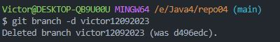

# Repo04 #
***
### 4.1 – Crea un directorio llamado repo04, esta vez tu decides como lo haces. Es decir, tendrás que seleccionar uno de los dos caminos que hemos visto en los dos ejercicios anteriores. Pero si que queremos que exista el repositorio el local y en remoto. ###

Creamos el repositorio desde [GitHub](https://github.com/ "https://github.com")

    Clonar en local:
    $ git clone "https://github.com/civic100/repo04.git"

***

### 4.2 – Añade un fichero readme.md vacío al repositorio local, ejecuta los comandos pertinentes para realizar un commit y finalmente, sube los cambios al repositorio remoto que tendrá el mismo nombre repo04.

    Crear un README.md vacío:  
    $ echo "" >> README.md
    
    Comandos para realizar commit y push:
    $ git add README.md
    $ git commit -m "repo04"
    $ git push  

***

### 4.3 – Crea una rama con tu nombre y la fecha actual (por ejemplo en mi caso la rama se llamará david02032022) desde la cual editaremos el fichero

    Creación de una nueva rama:
    $ git branch "nombre de la rama"

    Listar ramas:
    $ git branch

***

### 4.4 – Desde tu rama (david02032022) edita el fichero readme.md de tal forma que quede de la siguiente manera:

# Repo04 
***
Mi primer ejercicio con ramas

***
### 4.5 – Haz 3 commits desde nuestra rama (david02032022)

***

### 4.6 – En el siguiente orden realiza lo siguiente:
*  4.6.1 – Fusiona tu rama con master   
    Primero pasamos a la rama "main" y luego realizamos el $ git merge "nombre de la rama"
    

*  4.6.2 – Haz un push hacía la nube    

    Debemos guardar con add README.md y hacer un commit desde main antes de hacer el push para tener todos los cambios hasta el momento.

***
### 4.7 – Elimina solamente la rama en local david02032022 ya que si eliminásemos la remota no veríamos la rama en remoto.

    Eliminar rama desde local:
    $ git branch -d "nombre de la rama"

***
### 4.8 - Visualiza el resultado tanto mediante el comando git log --all --oneline -decorate –graph, como desde el pluging de VSC

* Usando el comando:   
  $ git log --all --oneline --decorate --graph 

* Usando el pluging: 

***